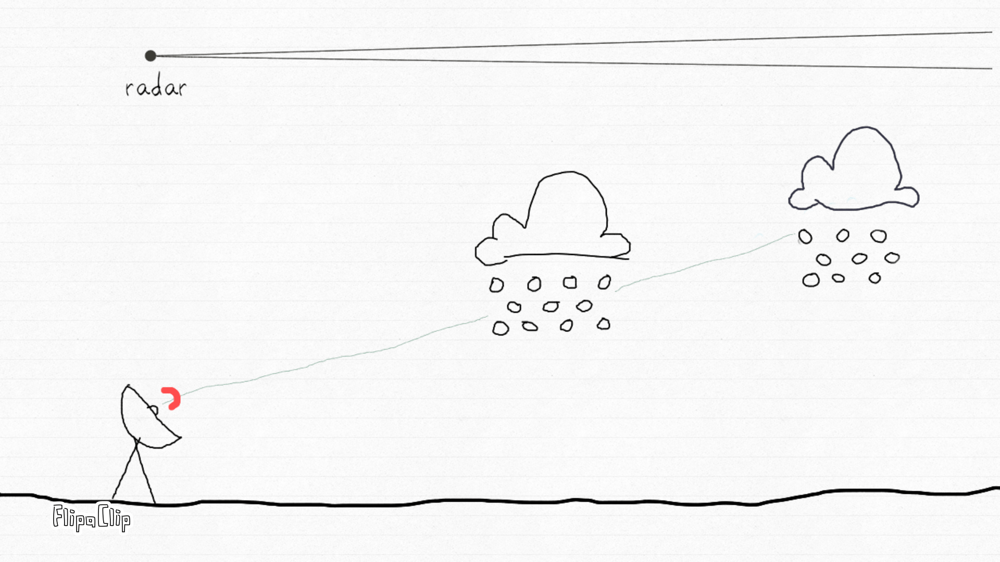
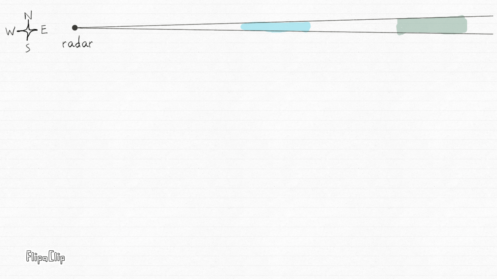

# A collection of short animated videos I made to explain some concepts in and around radar science

#### How radars collect rainfall information (Part 1)

#### How radars collect rainfall information (Part 2)

