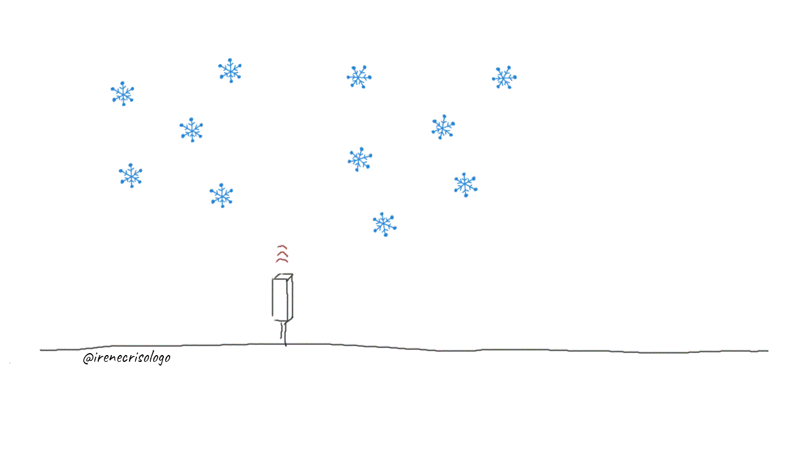

# A collection of short animated videos I made to explain some concepts in and around radar science

#### How radars work (short version)

#### How radars collect rainfall information (Part 1)

#### How radars collect rainfall information (Part 2)

#### Attenuation affects rainfall measurements

#### Raindrops are not tear drop shaped!

Raindrops start as small spheres. ❌💧 They collide with each other as they fall and merge to become bigger raindrops. As they grow, larger raindrops get flatter bottoms, because of the air pushing upwards. When a raindrop becomes too large, it splits into smaller spheres again.

#### Falling snow vs blowing snow as seen by ceilometer

Falling snow can be detected by ceilometers, which are vertically pointing lasers used to measure cloud tops/bottoms. Strong winds re-suspend snow and breaks the snowflakes, and more particles are detected. Idea from Aaron Kennedy.

#### Lidar detection of clouds and rain

